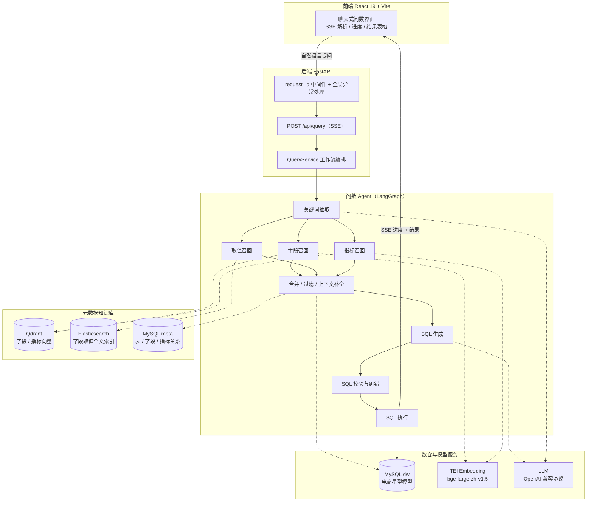
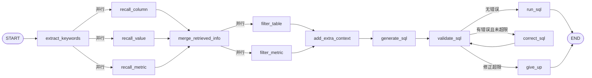

# DataAgent · 电商智能问数 Agent


面向电商数据分析场景的 **NL2SQL 智能问数 Agent**：业务人员不需要了解表结构、指标口径和字段取值，直接用自然语言提问，系统自动完成「语义召回 → 上下文组装 → SQL 生成 → 安全校验 → 限次纠错 → 真实数仓执行」全流程，并以 SSE 流式推送每个阶段的进度与最终结果。

<!-- TODO: 补充前端问答演示 GIF（docs/images/demo.gif） -->

## 核心特性

- **LangGraph 多阶段工作流**：关键词抽取 → 字段 / 指标 / 字段值三路**并行召回** → 信息合并 → 候选过滤 → SQL 生成 → EXPLAIN 校验 → 最多 3 次错误自修正 → 执行，通过共享 State 传递中间结果，全链路可观测、可修正。
- **元数据驱动的混合检索**：`meta_config.yaml` 声明式描述数仓的表 / 字段 / 指标（含中文别名与业务口径），构建流水线将其向量化后分别写入 Qdrant（字段 / 指标语义召回）与 Elasticsearch（字段真实取值全文召回，IK 分词），MySQL 元数据库负责关系补全，三者共同为 SQL 生成提供结构化上下文。
- **SQL 安全闭环**：sqlglot AST 级只读策略（单条 SELECT、表白名单、危险函数禁用、强制 LIMIT ≤ 1000）+ 数据库 EXPLAIN 预校验，校验失败自动携带错误信息进入有限次修正循环。
- **流式体验与链路追踪**：`POST /api/query` SSE 推送各阶段进度与最终结果集；`X-Request-ID` 中间件 + ContextVar + loguru 贯穿每一次问答的完整日志链路，生成的 SQL 全程可追溯。
- **评估驱动调参**：自建 30 条覆盖真实业务问法的评估集（执行准确率口径），支持向量召回阈值等参数的 A/B 对比实验，方法与复现见[评估](#评估)。

## 系统架构



Agent 工作流拓扑（与 `app/agent/graph.py` 一一对应）：



## 快速开始

### 前置要求

| 依赖 | 版本 | 说明 |
| --- | --- | --- |
| Docker Desktop | 任意近期版本 | 运行 MySQL / Qdrant / Elasticsearch / TEI |
| uv | ≥ 0.7 | Python 依赖管理（自动使用 Python 3.14） |
| Node.js / pnpm | ≥ 18 / ≥ 9 | 仅前端本地开发需要 |
| LLM API Key | — | 任意 OpenAI 兼容服务（默认配置为 SiliconFlow） |

> 磁盘：本地 Embedding 模型 `BAAI/bge-large-zh-v1.5` 约 1.4 GB。

### 1. 启动基础设施

```bash
# 下载本地 Embedding 模型权重（国内可加 HF_ENDPOINT=https://hf-mirror.com）
huggingface-cli download BAAI/bge-large-zh-v1.5 \
  --local-dir docker/embedding/bge-large-zh-v1.5

cd docker
docker compose up -d          # MySQL + Elasticsearch(IK) + Kibana + Qdrant + TEI
```

### 2. 配置并启动后端

```bash
cd ..
cp .env.example .env          # 填入 LLM_API_KEY
uv sync                       # 创建虚拟环境并安装依赖

# 构建元数据知识库：表/字段/指标 → MySQL meta + Qdrant + Elasticsearch
uv run python -m app.scripts.build_meta_knowledge -c conf/meta_config.yaml

uv run uvicorn main:app --reload    # http://localhost:8000，接口文档见 /docs
```

### 3. 启动前端

```bash
cd frontend
pnpm install
pnpm dev                      # http://localhost:5173
```

### 4. 验证

```bash
curl -N -X POST http://localhost:8000/api/query \
  -H "Content-Type: application/json" \
  -d '{"query": "统计各大区的销售额"}'
```

SSE 流式响应（节选，每个事件都携带 `request_id`）：

```
data: {"type": "progress", "step": "关键词抽取", "status": "running", "request_id": "..."}
data: {"type": "progress", "step": "生成SQL", "status": "success", "request_id": "..."}
data: {"type": "result", "data": [{"大区": "华南", "销售额": 51986.5}, ...], "request_id": "..."}
```

## 评估

评估集共 **30 条**真实业务问法，覆盖 5 类场景；采用**执行准确率**口径：对每条问题跑完整 Agent 工作流，将生成的 SQL 在真实数仓上的执行结果与黄金 SQL 的结果做行级比对（聚合类忽略行序、TopN 类保序、浮点保留 2 位小数容差）。

| 场景 | 题数 | 示例 |
| --- | --- | --- |
| 简单聚合 | 5 | 一季度的总销售额是多少？ |
| 分组聚合 | 8 | 按大区统计销售额 / 每个月的总销售额 |
| 排序 TopN | 5 | 销量排名前 5 的商品 |
| 单维过滤 | 7 | 华南地区的总销售额（依赖字段值召回） |
| 多维组合 | 5 | 黄金会员在手机数码品类的消费总额 |

**调优实验**：仅调整向量召回相似度阈值（`QDRANT_SCORE_THRESHOLD`），其余条件不变：

| 召回阈值 | 正确题数 | 执行准确率 |
| --- | --- | --- |
| 0.6 | 待测评 | — |
| **0.8** | 待测评 | — |

> 原理：阈值过低时低相关字段大量混入上下文，模型易被无关表字段带偏；提高阈值后召回上下文更聚焦，配合「仅允许使用召回表结构生成 SQL」的提示词约束，可显著提升准确率。在 `.env` 配置有效的 `LLM_API_KEY` 后运行下方命令，即可在 `eval/results/` 生成 `report_*.json` 明细与 `summary_*.md` 摘要并回填本表。

复现评估（需先完成快速开始 1-2 步）：

```bash
# 阈值 0.8（默认）
uv run python eval/run_eval.py --label threshold-0.8

# 阈值 0.6 对照组
QDRANT_SCORE_THRESHOLD=0.6 uv run python eval/run_eval.py --label threshold-0.6
```

## 工程设计细节

- **统一错误协议**：请求体校验、业务错误、系统异常统一转换为 `{code, message, request_id}` 结构；SSE 响应开始后无法再改 HTTP 状态码，异常同样包装为 `terminal` 错误事件下发。
- **链路日志**：中间件为每个请求生成 UUID 并写入 ContextVar，loguru 日志与 SSE 事件全程携带，前端报障时凭 `X-Request-ID` 即可回放整条链路。
- **SQLGuard（sqlglot AST）**：仅允许单条 SELECT；表白名单校验；禁用 `SLEEP / BENCHMARK / LOAD_FILE / UUID` 等危险函数；强制 `LIMIT ≤ 1000` 且必须为整型常量。
- **分层架构**：api（路由 / 校验 / 错误）→ agent（图编排）→ services（编排 / 知识构建 / SQL 策略）→ repositories（存储访问）→ clients（连接管理），依赖逐层注入，节点不直接持有客户端。
- **容器化**：后端两阶段 Dockerfile（uv 缓存层）；前端 Nginx 镜像托管静态资源并对 `/api/` 反向代理（SSE 关闭缓冲、300s 读超时）。

## 项目结构

```
data-agent/
├── main.py                    # FastAPI 入口：request_id 中间件 + 异常处理 + 路由
├── app/
│   ├── api/                   # 路由、Schemas、生命周期、统一错误协议
│   ├── agent/                 # LangGraph 图编排、State/Context、14 个节点
│   ├── services/              # 查询编排、元数据知识构建、SQLGuard
│   ├── repositories/          # MySQL(meta/dw) / Qdrant / ES 仓储
│   ├── clients/               # 各外部服务懒加载连接管理器
│   ├── conf/                  # 结构化配置（OmegaConf + .env）
│   └── scripts/               # 知识库构建 CLI
├── conf/                      # app_config.yaml（连接/阈值）+ meta_config.yaml（数仓元数据）
├── prompts/                   # 各节点提示词模板
├── eval/                      # 30 条评估集 + 端到端评估运行器
├── frontend/                  # React 19 + Vite + Tailwind 聊天前端
├── docker/                    # compose：MySQL/ES(IK)/Kibana/Qdrant/TEI + 初始化 SQL
└── Dockerfile                 # 后端两阶段构建
```

## License

[MIT](LICENSE)
